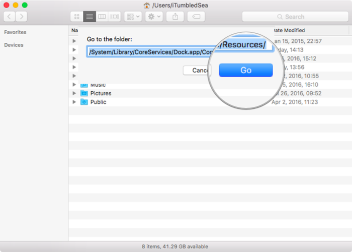
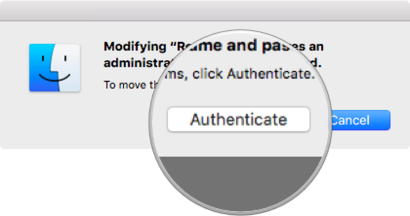
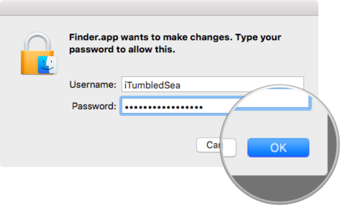
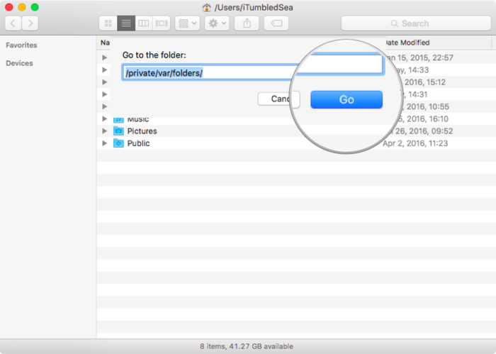
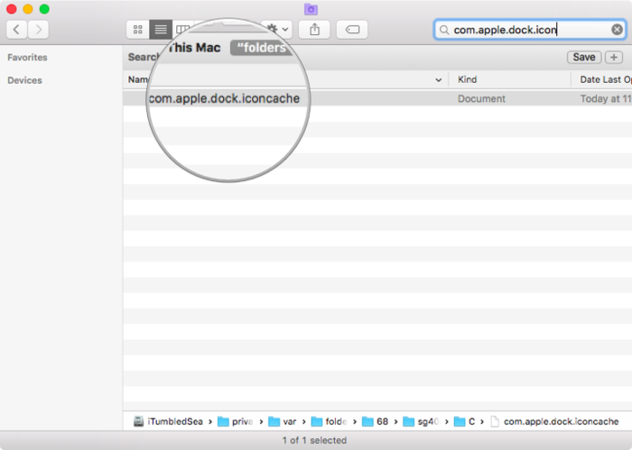
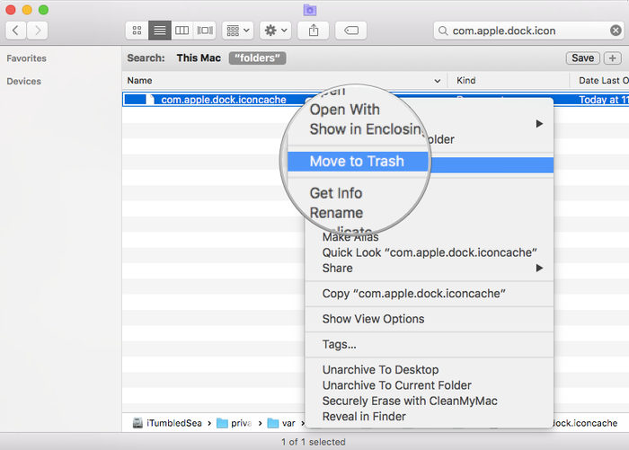
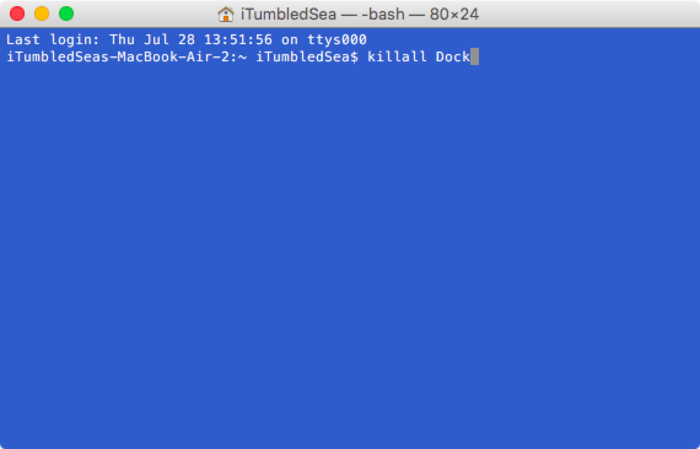

### 如何替换 Mac 的 Finder 图标

[Finder红色图标下载](http://t.cn/Rtt6hR1)

由于 El Capitan之后 默认启用了系统完整性保护,即SIP（System Integrity Protection）机制，在开始替换源文件之前，我们需要先手动禁用这一机制。在替换图标完毕之后，还需要手动清空图标缓存，才能看到系统应用图标替换后的最终效果。

**第一步：[关闭系统完整性保护机制(SIP)](/disable_SIP.md)**

1. 将你的 Mac 电脑关机，按下开机键后同时按住 `Command+R`，进入`恢复模式`。
2. 点击菜单栏的`工具`，然后再下拉菜单中选择`终端`打开(**如果没有`工具`选项那么需要插入USB启动盘再进入`恢复模式`,这时候`工具`选项即会显示出来**)。
3. 在终端中输入 `csrutil disable` 命令，并按下回车确认。
4. 重启 Mac，即完成了禁用系统完整性保护机制。
5. 可以输入命令`csrutil status`查看SIP状态。

**第二步：替换 Finder 图标**
1. 打开 Finder 窗口，按下 `Command+Shift+G` 快捷键，呼出`前往文件夹`对话框。

2. 输入路径 `/System/Library/CoreServices/Dock.app/Contents/Resources/` 后，按回车键。

3. 找到并备份 finder.png 与 finder@2x.png 两个文件（重要）。

4. 将提前下载好的两张 Finder 图标素材图片拖入此窗口进行替换，输入管理员密码来`授权`确认即可。

**第三步：清空图标缓存**
1. 在`前往文件夹`对话内输入路径 `/private/var/folders/` 并按下回车键（参考上一阶段的步骤 1 和步骤 2）。

2. 在 Finder 右上角搜索框内搜索 `com.apple.dock.iconcache`（注意需在`folders`范围内进行）。

3. 选中它并删除。

4. 打开`终端`应用程序，在终端窗口内输入 `killall Dock` 后，按下回车确认即可。

现在你就可以看到替换好的新的 Finder 图标啦！

